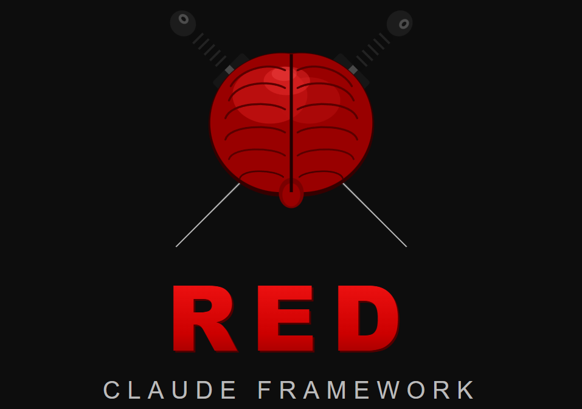

<p align="center">
  
</p>

# Offensive Security Template — Framework Modular para Claude Code

Template global, modular e adaptável para conduzir operações de segurança
ofensiva com o Claude Code. Funciona para Web, API, Mobile,
Network, Red Team, Bug Bounty e pentest corporativo.

> **Novo por aqui? Comece pelo [GUIA-DE-USO.md](GUIA-DE-USO.md)** — documentação
> completa com início rápido, referência de comandos e um exemplo prático do começo ao fim.

## Como funciona

O `CLAUDE.md` na raiz é o cérebro. Você edita o bloco `CONFIG` dele para cada
engajamento (tipo de alvo, abordagem, profundidade, metodologias). O Claude Code
lê isso automaticamente e ativa apenas os módulos relevantes:

- **`specs/scenarios/`** — perfis por tipo de alvo. Cada um define a superfície,
  ferramentas típicas e checklist específico.
- **`specs/methodologies/`** — referência das metodologias (WSTG, PTES, OSSTMM,
  OWASP Top 10, API Top 10). Ative/desative no CONFIG.
- **`.claude/commands/`** — comandos reutilizáveis (`/recon`, `/enum`, etc.) que
  orquestram cada fase.
- **`findings/`** — um arquivo por vulnerabilidade, padronizado.
- **`specs/reporting/`** — guia de CVSS e modelo de relatório final.

## Início rápido

```bash
# 1. Copie o template para o seu projeto
cp -r offensive-security-template meu-engajamento
cd meu-engajamento

# 2. Preencha a autorização e o escopo (OBRIGATÓRIO)
$EDITOR specs/00-escopo.md

# 3. Ajuste o CONFIG no CLAUDE.md (cenário, abordagem, profundidade)
$EDITOR CLAUDE.md

# 4. Abra o Claude Code na pasta
claude

# 5. Rode as fases
/recon
/threat-model
/enum
/validate
/report
```

## Filosofia de design

- **Modular** — cada seção é independente; ative só o que precisa.
- **Seguro por padrão** — `profundidade: standard` não explora ativamente.
  Você precisa elevar conscientemente para `deep`/`full`.
- **Rastreável** — tudo vira artefato em `findings/` e `evidence/`.
- **Prático** — checklists acionáveis, não teoria solta.
- **Automatável** — estrutura pronta para evoluir com scripts em `scripts/`.
